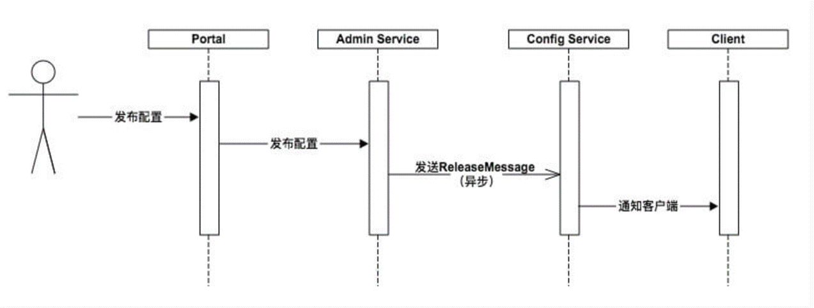

## apollo 热更新原理
#### 更新流程
  1.SpringValueProcess实现了BeanFactoryPostProcessor, BeanFactoryAware
  通过这个类可以获取到字段上对应的@value的值
  2.SpringValueRegistry 会将@value的配置项全部加到缓存中
  3.PropertySourcesProcessor会给每个nameSpace添加一个监听
  AutoUpdateConfigChangeListener获取到监听之后就会通过反射来修改对应的属性
#### 监听是如何触发的

adminService 发布配置之后就会向ReleaseMessage表里插入一调数据
ConfigService会定时扫描ReleaseMessage通知Client数据有更新
数据的更新有三种方式:定时轮询,立即轮询,长轮询
