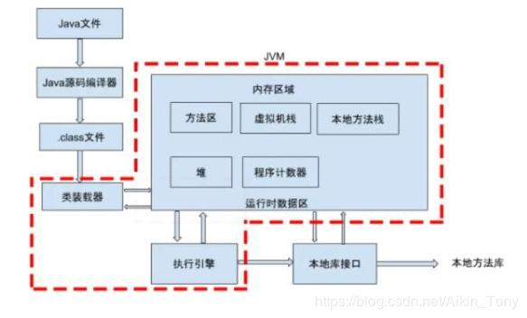
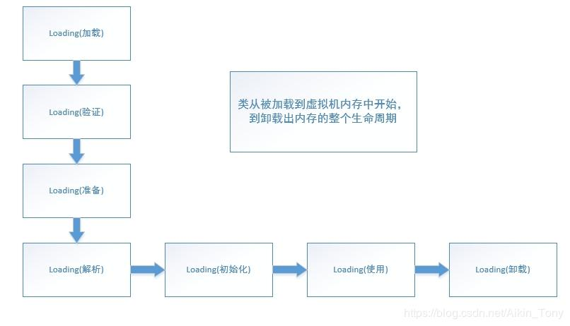
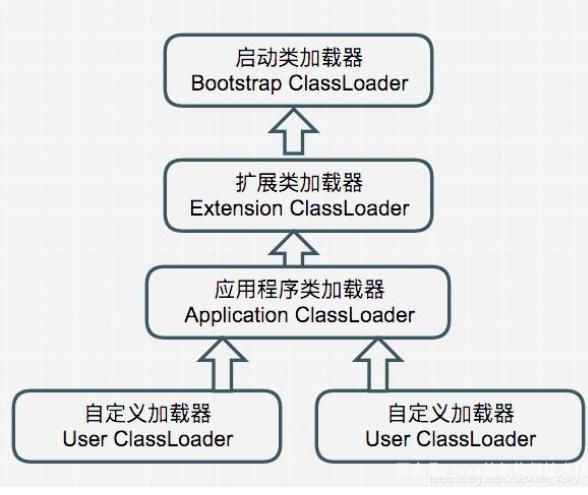

## 类加载流程

类加载过程主要分为:加载-->验证-->准备--->解析---->初始化--->使用---->卸载
”加载“是”类加机制”的第一个过程，在加载阶段，虚拟机主要完成三件事：
（1）通过一个类的全限定名来获取其定义的二进制字节流。
（2）将这个字节流所代表的的静态存储结构转化为方法区的运行时数据结构。
（3）在堆中生成一个代表这个类的Class对象，作为方法区中这些数据的访问入口。
相对于类加载的其他阶段而言，加载阶段是可控性最强的阶段，因为程序员可以使用系统的类加载器加载，还可以使用自己的类加载器加载。

2、验证
验证的主要作用就是确保被加载的类的正确性。也是连接阶段的第一步。说白了也就是我们加载好的.class文件不能对我们的虚拟机有危害，所以先检测验证一下。他主要是完成四个阶段的验证：
（1）文件格式的验证：验证.class文件字节流是否符合class文件的格式的规范，并且能够被当前版本的虚拟机处理。这里面主要对魔数、主版本号、常量池等等的校验（魔数、主版本号都是.class文件里面包含的数据信息、在这里可以不用理解）。
（2）元数据验证：主要是对字节码描述的信息进行语义分析，以保证其描述的信息符合java语言规范的要求，比如说验证这个类是不是有父类，类中的字段方法是不是和父类冲突等等。
（3）字节码验证：这是整个验证过程最复杂的阶段，主要是通过数据流和控制流分析，确定程序语义是合法的、符合逻辑的。在元数据验证阶段对数据类型做出验证后，这个阶段主要对类的方法做出分析，保证类的方法在运行时不会做出威海虚拟机安全的事。
（4）符号引用验证：它是验证的最后一个阶段，发生在虚拟机将符号引用转化为直接引用的时候。主要是对类自身以外的信息进行校验。目的是确保解析动作能够完成。
对整个类加载机制而言，验证阶段是一个很重要但是非必需的阶段，如果我们的代码能够确保没有问题，那么我们就没有必要去验证，毕竟验证需要花费一定的的时间。当然我们可以使用-Xverfity:none来关闭大部分的验证。

3、准备
准备阶段主要为类变量分配内存并设置初始值。这些内存都在方法区分配。在这个阶段我们只需要注意两点就好了，也就是类变量和初始值两个关键词：
（1）类变量（static）会分配内存，但是实例变量不会，实例变量主要随着对象的实例化一块分配到java堆中。
（2）这里的初始值指的是数据类型默认值，而不是代码中被显示赋予的值。比如
public static int value = 1; //在这里准备阶段过后的value值为0，而不是1。赋值为1的动作在初始化阶段。

4、解析
解析阶段主要是虚拟机将常量池中的符号引用转化为直接引用的过程。什么是符号应用和直接引用呢？
符号引用：以一组符号来描述所引用的目标，可以是任何形式的字面量，只要是能无歧义的定位到目标就好，就好比在班级中，老师可以用张三来代表你，也可以用你的学号来代表你，但无论任何方式这些都只是一个代号（符号），这个代号指向你。
直接引用：直接引用是可以指向目标的指针、相对偏移量或者是一个能直接或间接定位到目标的句柄。和虚拟机实现的内存有关，不同的虚拟机直接引用一般不同。
解析动作主要针对类或接口、字段、类方法、接口方法、方法类型、方法句柄和调用点限定符7类符号引用进行。

5、初始化
这是类加载机制的最后一步，在这个阶段，java程序代码才开始真正执行。我们知道，在准备阶段已经为类变量赋过一次值。在初始化阶端，程序员可以根据自己的需求来赋值了。一句话描述这个阶段就是执行类构造器< clinit >()方法的过程。
在初始化阶段，主要为类的静态变量赋予正确的初始值，JVM负责对类进行初始化，主要对类变量进行初始化。在Java中对类变量进行初始值设定有两种方式：
①声明类变量是指定初始值
②使用静态代码块为类变量指定初始值
JVM初始化步骤
（1）假如这个类还没有被加载和连接，则程序先加载并连接该类。
（2）假如该类的直接父类还没有被初始化，则先初始化其直接父类。
（3）假如类中有初始化语句，则系统依次执行这些初始化语句。
类初始化时机：只有当对类的主动使用的时候才会导致类的初始化，类的主动使用包括以下六种：
创建类的实例，也就是new的方式
访问某个类或接口的静态变量，或者对该静态变量赋值
调用类的静态方法
反射（如 Class.forName(“com.shengsiyuan.Test”)）
初始化某个类的子类，则其父类也会被初始化
Java虚拟机启动时被标明为启动类的类（ JavaTest），直接使用 java.exe命令来运行某个主类
好了，到目前为止就是类加载机制的整个过程，但是还有一个重要的概念，那就是类加载器。在加载阶段其实我们提到过类加载器，说是在后面详细说，在这就好好地介绍一下类加载器。

类加载器
虚拟机设计团队把加载动作放到JVM外部实现，以便让应用程序决定如何获取所需的类。

1、Java语言系统自带有三个类加载器
1.1 Bootstrap ClassLoader ：最顶层的加载类，主要加载核心类库，也就是我们环境变量下面%JRE_HOME%\lib下的rt.jar、resources.jar、charsets.jar和class等。另外需要注意的是可以通过启动jvm时指定-Xbootclasspath和路径来改变Bootstrap ClassLoader的加载目录。比如java -Xbootclasspath/a:path被指定的文件追加到默认的bootstrap路径中。我们可以打开我的电脑，在上面的目录下查看，看看这些jar包是不是存在于这个目录。
1.2 Extention ClassLoader ：扩展的类加载器，加载目录%JRE_HOME%\lib\ext目录下的jar包和class文件。还可以加载-D java.ext.dirs选项指定的目录。
1.3Appclass Loader：也称为SystemAppClass。 加载当前应用的classpath的所有类。

我们看到java为我们提供了三个类加载器，应用程序都是由这三种类加载器互相配合进行加载的，如果有必要，我们还可以加入自定义的类加载器。这三种类加载器的加载顺序是什么呢？
Bootstrap ClassLoader > Extention ClassLoader > Appclass Loader
