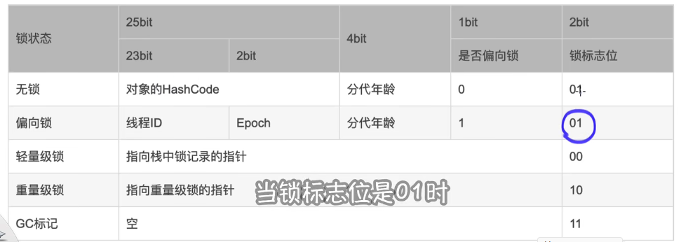

# 同步锁:
 1.保证并发下的线程安全:保存线程的原则操作
### 实现原理:
 1.sync同步锁通过monitor来实现,
 底层会在同步代码块的添加monitorEnter和moniterexit来保证只能由一个线程来执行对应的资源
 而monitor是依赖操作系统的mutex lock 来实现的 
 2.对象分为对象头和对象体和对齐填充,对象头有分为方法区的指针和mark word. markWord就是
 记录对象锁相关信息的地方

### 4种锁详解
#### 1.无锁化
就是资源是不存在在争抢的,就算是存在也是线程安全的,所以不需要加锁
#### 2.偏向锁
偏向锁就是对象记录了线程了id后续相同的线程来请求资源的时候就可以直接获取锁了
#### 3.轻量级锁
获取锁的线程会在栈种
实现:开辟一个lockrecord的空间将对象的markword复制到lockrecord中,
并且维护一个☞向锁对象的指针,锁对象也会记录指向栈中锁记录的指针.

锁的当前是偏向锁的时候,又有其他的线程来请求锁的时候,
偏向锁就会变成轻量级锁,这个时候线程就会通过自旋来尝试获取锁,这个时候会消耗cpu资源,
jvm也做了自适应自旋的优化:会基于上次自旋获取锁的时间和锁状态来作自旋.
#### 4.重量级锁
当锁是轻量级锁的时,出现超过1个线程来获取锁的时候,锁就会升级为重量级锁,
这个时候就会添加montitorEnter/monitorexit来严格限制,
后续的线程就会被阻塞,只有当持有锁的线程释放锁的时候才会重新唤醒锁来争抢当前的锁,
这个时候就涉及到了线程的阻塞/唤醒,而且也会涉及到底层用户态和内核态的切换来调用操作系统的指令.
