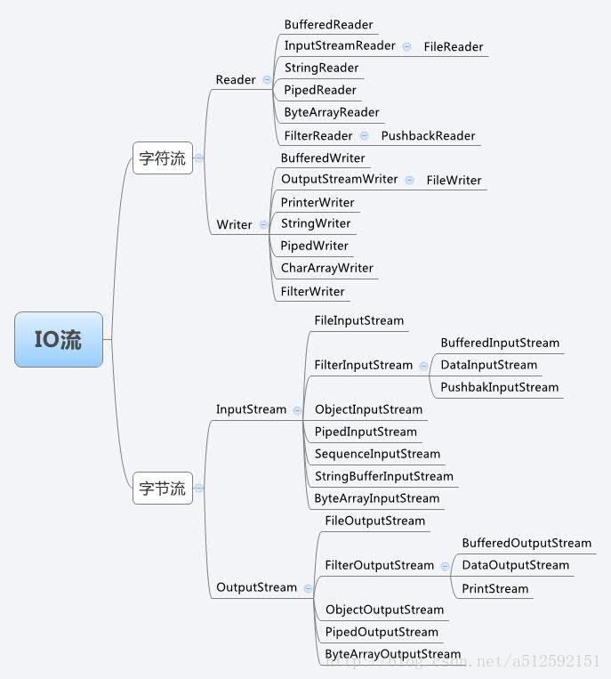
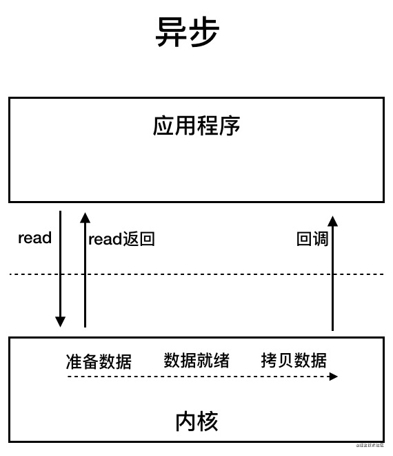
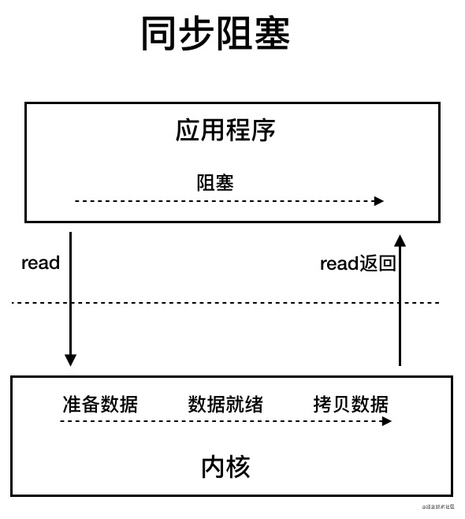
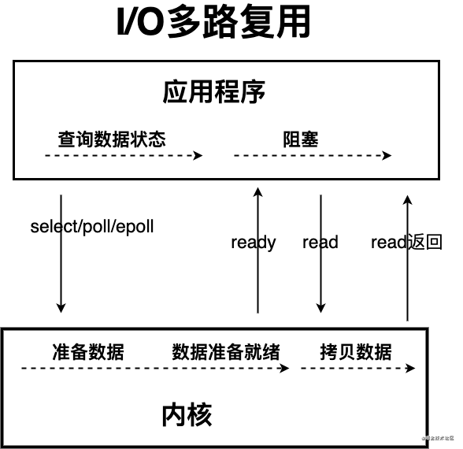
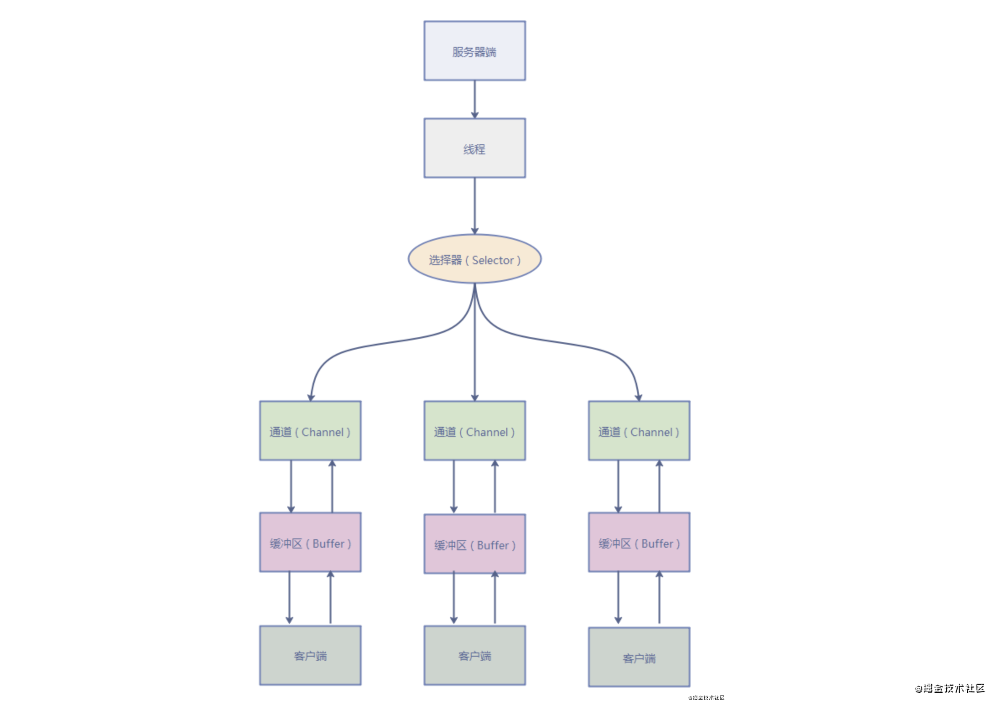

#io 基础

### io 分为字节流和字符流程
#### 字节流流可以操作所有类型的数据
#### 字符流只能操作文本,字符流的数据效率较高
### 缓冲流:
    可以提高io的操作效率:因为程序和磁盘的交互是很浪费性能的.而缓冲流在内存中设置一个缓存区，缓冲区先存储足够的待操作数据后，再与内存或磁盘进行交互。这样，在总数据量不变的情况下，通过提高每次交互的数据量，减少了交互次数
##### BufferedInputStream、BufferedOutputStream（缓冲字节流）
##### BufferedReader、BufferedWriter（字符缓冲流）
### 基本使用
    一、按数据来源（去向）分类：
    1 、是文件： FileInputStream, FileOutputStream, ( 字节流 )FileReader, FileWriter( 字符 )
    2 、是 byte[] ： ByteArrayInputStream, ByteArrayOutputStream( 字节流 )
    3 、是 Char[]: CharArrayReader, CharArrayWriter( 字符流 )
    4 、是 String: StringBufferInputStream, StringBufferOuputStream ( 字节流 )StringReader, StringWriter( 字符流 )
    5 、网络数据流： InputStream, OutputStream,( 字节流 ) Reader, Writer( 字符流 )
    二、按是否格式化输出分：
    1 、要格式化输出： PrintStream, PrintWriter
    三、按是否要缓冲分：
    1 、要缓冲： BufferedInputStream, BufferedOutputStream,( 字节流 ) BufferedReader, BufferedWriter( 字符流 )
    四、按数据格式分：
    1 、二进制格式（只要不能确定是纯文本的） : InputStream, OutputStream 及其所有带 Stream 结束的子类
    2 、纯文本格式（含纯英文与汉字或其他编码方式）； Reader, Writer 及其所有带 Reader, Writer 的子类
    五、按输入输出分：
    1 、输入： Reader, InputStream 类型的子类
    2 、输出： Writer, OutputStream 类型的子类
    六、特殊需要：
    1 、从 Stream 到 Reader,Writer 的转换类： InputStreamReader, OutputStreamWriter
    2 、对象输入输出： ObjectInputStream, ObjectOutputStream
    3 、进程间通信： PipeInputStream, PipeOutputStream, PipeReader, PipeWriter
    4 、合并输入： SequenceInputStream
    5 、更特殊的需要： PushbackInputStream, PushbackReader, LineNumberInputStream, LineNumberReader
    决定使用哪个类以及它的构造进程的一般准则如下（不考虑特殊需要）：
    首先，考虑最原始的数据格式是什么： 原则四
    第二，是输入还是输出：原则五
    第三，是否需要转换流：原则六第 1 点
    第四，数据来源（去向）是什么：原则一
    第五，是否要缓冲：原则三 （特别注明：一定要注意的是 readLine() 是否有定义，有什么比 read, write 更特殊的输入或输出方法）
    第六，是否要格式化输出：原则二
 ### AIO
AIO 也就是 NIO 2。Java 7 中引入了 NIO 的改进版 NIO 2,它是异步 IO 模型。

异步 IO 是基于事件和回调机制实现的，也就是应用操作之后会直接返回，不会堵塞在那里，当后台处理完成，操作系统会通知相应的线程进行后续的操作。

 ### BIO
BIO 属于同步阻塞 IO 模型 。
同步阻塞 IO 模型中，应用程序发起 read 调用后，会一直阻塞，直到内核把数据拷贝到用户空间。

在客户端连接数量不高的情况下，是没问题的。但是，当面对十万甚至百万级连接的时候，传统的 BIO 模型是无能为力的。因此，我们需要一种更高效的 I/O 处理模型来应对更高的并发量。
 ### NIO
    Java 中的 NIO 于 Java 1.4 中引入，对应 java.nio 包，提供了 Channel , Selector，Buffer 等抽象。NIO 中的 N 可以理解为 Non-blocking，不单纯是 New。它支持面向缓冲的，基于通道的 I/O 操作方法。 对于高负载、高并发的（网络）应用，应使用 NIO 。
    
    Java 中的 NIO 可以看作是 I/O 多路复用模型。也有很多人认为，Java 中的 NIO 属于同步非阻塞 IO 模型。
    
    跟着我的思路往下看看，相信你会得到答案！
    
    我们先来看看 同步非阻塞 IO 模型。

    同步非阻塞 IO 模型中，应用程序会一直发起 read 调用，等待数据从内核空间拷贝到用户空间的这段时间里，线程依然是阻塞的，直到在内核把数据拷贝到用户空间。
    
    相比于同步阻塞 IO 模型，同步非阻塞 IO 模型确实有了很大改进。通过轮询操作，避免了一直阻塞。
    
    但是，这种 IO 模型同样存在问题：应用程序不断进行 I/O 系统调用轮询数据是否已经准备好的过程是十分消耗 CPU 资源的。
    
    这个时候，I/O 多路复用模型 就上场了。

    IO 多路复用模型中，线程首先发起 select 调用，询问内核数据是否准备就绪，等内核把数据准备好了，用户线程再发起 read 调用。read 调用的过程（数据从内核空间->用户空间）还是阻塞的。
    
    目前支持 IO 多路复用的系统调用，有 select，epoll 等等。select 系统调用，是目前几乎在所有的操作系统上都有支持
    
    select 调用 ：内核提供的系统调用，它支持一次查询多个系统调用的可用状态。几乎所有的操作系统都支持。
    epoll 调用 ：linux 2.6 内核，属于 select 调用的增强版本，优化了 IO 的执行效率。
    IO 多路复用模型，通过减少无效的系统调用，减少了对 CPU 资源的消耗。
    
    Java 中的 NIO ，有一个非常重要的选择器 ( Selector ) 的概念，也可以被称为 多路复用器。通过它，只需要一个线程便可以管理多个客户端连接。当客户端数据到了之后，才会为其服务。

 ### select、poll、epoll详解
一、概念说明

    1、内核态（内核空间）和用户态（用户空间）的区别和联系？
    
    用户空间是用户进程所在的内存区域，系统空间是操作系统所在的内存区域。
    
    为了保证内核的安全，处于用户态的程序只能访问用户空间，而处于内核态的程序可以访问用户空间和内核空间。
    
    2、文件描述符fd
    
    Linux将所有设备都当做文件来处理，文件描述符来标识每个文件对象。
    
    当程序打开一个现有文件或者创建一个新文件时，内核向进程返回一个文件描述符。
    
    3、缓存IO
    
    Linux的缓存IO机制中，操作系统会将IO的数据缓存在文件系统的页缓存中，也就是说，数据会先被拷贝到操作系统内核的缓冲区，然后才会从操作系统内核的缓冲区拷贝到应用程序的地址空间。
 ### 基本概念
    select，poll，epoll都是IO多路复用的机制。I/O多路复用就是通过一种机制，一个进程可以监视多个描述符，一旦某个描述符就绪（一般是读就绪或者写就绪），能够通知程序进行相应的读写操作。但select，poll，epoll本质上都是同步I/O，因为他们都需要在读写事件就绪后自己负责进行读写，也就是说这个读写过程是阻塞的，而异步I/O则无需自己负责进行读写，异步I/O的实现会负责把数据从内核拷贝到用户空间。
    
    1、select
    
    select函数监视文件描述符，调用后select函数会阻塞，直到有描述符就绪，或者超时，函数返回，当select函数返回后，就可以遍历描述符，找到就绪的描述符。
    
    select的一个缺点在于单个进程能够监视的文件描述符的数量也存在最大限制，在Linux上一般为1024，可以通过修改宏定义甚至重新编译内核的方式提升这一限制。但是这样也会造成效率的降低。
    
    2、poll
    
    没有最大限制（但是数量过大后性能也是会下降）。和select函数一样，poll返回后，需要轮询来获取就绪的描述符。
    
    select和poll都需要在返回后，通过遍历文件描述符来获取已经就绪的socket。事实上，同时连接的大量客户端在同一时刻可能只有很少的就绪状态，因此随着监视的描述符数量的增长，其效率也会线性下降。
    
    3、epoll
    
    相对于select和poll来说，epoll更加灵活，没有描述符限制。epoll使用一个文件描述符管理多个描述符
 ### 实现细节
    如果没有I/O事件产生，我们的程序就会阻塞在select处。但是依然有个问题，我们从select那里仅仅知道了，有I/O事件发生了，但却并不知道是那几个流（可能有一个，多个，甚至全部），我们只能无差别轮询所有流，找出能读出数据，或者写入数据的流，对他们进行操作。
    但是使用select，我们有O(n)的无差别轮询复杂度，同时处理的流越多，没一次无差别轮询时间就越长。再次
    说了这么多，终于能好好解释epoll了
    epoll可以理解为event poll，不同于忙轮询和无差别轮询，epoll之会把哪个流发生了怎样的I/O事件通知我们。此时我们对这些流的操作都是有意义的。（复杂度降低到了O(1)）
 ### 0拷贝扫盲
https://mp.weixin.qq.com/s/FgBCop2zFfcX5ZszE0NoCQ

## 线程池
      一.如何设置合理的线程池:
      阻塞队列:
      LinkedBlockingQueue:可以设置大小的无界队列,当任务耗时较长时可能会导致大量新任务在队列中堆积最终导致OOM
      ArrayBlockingQueue:一类是遵循FIFO原则的队列如ArrayBlockingQueue，另一类是优先级队列如PriorityBlockingQueue。PriorityBlockingQueue中的优先级由任务的Comparator决定。
      使用有界队列时队列大小需和线程池大小互相配合，线程池较小有界队列较大时可减少内存消耗，降低cpu使用率和上下文切换，但是可能会限制系统吞吐量。
      SynchronousQueue:SynchronousQueue不是一个真正的队列，而是一种线程之间移交的机制。要将一个元素放入SynchronousQueue中，必须有另一个线程正在等待接收这个元素。
      只有在使用无界线程池或者有抛弃策略时才建议使用该队列。
      抛弃策略:
      AbortPolicy:该方法直接抛出拒绝异常
      CallerRunsPolicy:就是调用者执行
      DiscardPolicy:直接丢弃，不做任何处理
      DiscardOldestPolicy:这种策略指的是丢弃等待队列里头节点的任务，执行刚提交的任务
  