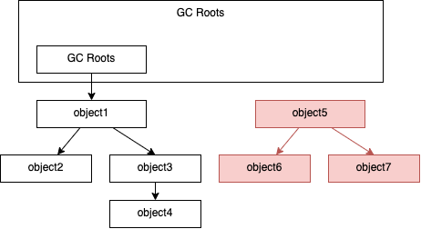
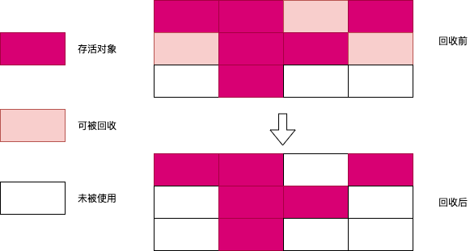
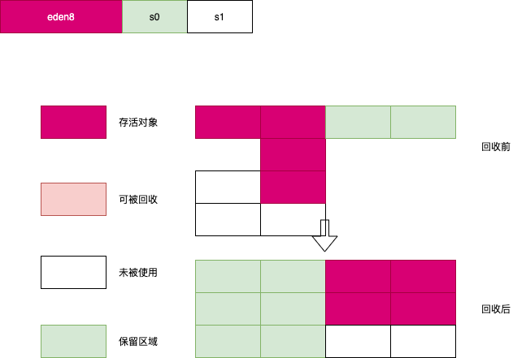

## 一.GC算法

###对象的可回收判定算法:

#### 引用计数算法
    会有循环依赖的问题

#### 可达性分析算法
    这个算法的基本思路就是通过一系列称为“GC Roots”的根对象作为起始节点集，从这些节点开始，根据引用关系向下搜索，搜索过程所走过的路径称为“引用链”（Reference Chain），
    如果某个对象到GC Roots间没有任何引用链相连，或者用图论的话来说就是从GC Roots到这个对象不可达时，则证明此对象是不可能再被使用的。

    GC Roots:
    在虚拟机栈（栈帧中的本地变量表）中引用的对象，譬如各个线程被调用的方法堆栈中使用到的参数、局部变量、临时变量等。
    在元空间中类静态属性引用的对象，譬如Java类的引用类型静态变量。
    在方法区中常量引用的对象，譬如字符串常量池（String Table）里的引用。
    在本地方法栈中JNI（即通常所说的Native方法）引用的对象。
    Java虚拟机内部的引用，如基本数据类型对应的Class对象，一些常驻的异常对象（比如NullPointExcepiton、OutOfMemoryError）等，还有系统类加载器。
    所有被同步锁（synchronized关键字）持有的对象。
    反映Java虚拟机内部情况的JMXBean、JVMTI中注册的回调、本地代码缓存等。

#### 分代收集理论
    三个假说前提：
    弱分代假说（Weak Generational Hypothesis）：绝大多数对象都是朝生夕灭的。
    强分代假说（Strong Generational Hypothesis）：熬过越多次垃圾收集过程的对象就越难以消亡。
    跨代引用假说（Intergenerational Reference Hypothesis）：跨代引用相对于同代引用来说仅占极少数。
    收集器应该将Java堆划分出不同的区域，然后将回收对象依据其年龄（年龄即对象熬过垃圾收集过程的次数）分配到不同的区域之中存储。
    
    假说3的实践：只需在新生代上建立一个全局的数据结构（该结构被称为“记忆集”，Remembered Set），这个结构把老年代划分成若干小块，标识出老年代的哪一块内存会存在跨代引用。
    此后当发生Minor GC时，只有包含了跨代引用的小块内存里的对象才会被加入到GC Roots进行扫描。虽然这种方法需要在对象改变引用关系（如将自己或者某个属性赋值）时维护记录数据的正确性，会增加一些运行时的开销，但比起收集时扫描整个老年代来说仍然是划算的。
    
    部分收集：
    
    新生代收集（Minor GC/Young GC）：指目标只是新生代的垃圾收集。
    老年代收集（Major GC/Old GC）：指目标只是老年代的垃圾收集。目前只有CMS收集器会有单独收集老年代的行为。另外请注意“Major GC”这个说法现在有点混淆，在不同资料上常有不同所指，读者需按上下文区分到底是指老年代的收集还是整堆收集。
    混合收集（Mixed GC）：指目标是收集整个新生代以及部分老年代的垃圾收集。目前只有G1收集器会有这种行为。
    整堆收集（Full GC）：收集整个Java堆和方法区的垃圾收集。

#### 标记-清除算法（mark-sweep）
    缺点：
    执行效率不稳定，如果Java堆中包含大量对象，而且其中大部分是需要被回收的，这时必须进行大量标记和清除的动作，导致标记和清除两个过程的执行效率都随对象数量增长而降低
    内存空间的碎片化问题，标记、清除之后会产生大量不连续的内存碎片，空间碎片太多可能会导致当以后在程序运行过程中需要分配较大对象时无法找到足够的连续内存而不得不提前触发另一次垃圾收集动作

#### 标记-复制算法（mark-copy）
    仍然存在：大量可回收对象时执行效率低。
    为了解决标记-清除算法面对内存碎片化问题。出现了标记-复制算法：
    它将可用内存按容量划分为大小相等的两块，每次只使用其中的一块。当这一块的内存用完了，就将还存活着的对象复制到另外一块上面，然后再把已使用过的内存空间一次清理掉。
    如果内存中多数对象都是存活的，这种算法将会产生大量的内存间复制的开销，但对于多数对象都是可回收的情况，算法需要复制的就是占少数的存活对象。
    而且每次都是针对整个半区进行内存回收，分配内存时也就不用考虑有空间碎片的复杂情况，只要移动堆顶指针，按顺序分配即可。

    具体做法是把新生代分为一块较大的Eden空间和两块较小的Survivor空间，每次分配内存只使用Eden和其中一块Survivor。
    发生垃圾搜集时，将Eden和Survivor中仍然存活的对象一次性复制到另外一块Survivor空间上，然后直接清理掉Eden和已用过的那块Survivor空间。
    HotSpot虚拟机默认Eden和Survivor的大小比例是8∶1，也即每次新生代中可用内存空间为整个新生代容量的90%（Eden的80%加上一个Survivor的10%），只有一个Survivor空间，即10%的新生代是会被“浪费”的。

#### 标记-整理算法（mark-compact）
    标记-复制算法的缺点：
    当对象存活率较高时就要进行较多的复制操作，效率将会降低。
    如果不想浪费50%的空间，就需要有额外的空间进行分配担保，以应对被使用的内存中所有对象都100%存活的极端情况。
    标记-清除算法与标记-整理算法的本质差异在于前者是一种非移动式的回收算法，而后者是移动式的。是否移动回收后的存活对象是一项优缺点并存的风险决策：
    
    如果移动存活对象，尤其是在老年代这种每次回收都有大量对象存活区域，移动存活对象并更新所有引用这些对象的地方将会是一种极为负重的操作，
    而且这种对象移动操作必须全程暂停用户应用程序才能进行，这就更加让使用者不得不小心翼翼地权衡其弊端了，像这样的停顿被最初的虚拟机设计者形象地描述为“StopThe World”。
    如果通过“分区空闲分配链表”来解决内存分配问题（计算机硬盘存储大文件就不要求物理连续的磁盘空间，能够在碎片化的硬盘上存储和访问就是通过硬盘分区表实现的）。
    内存的访问是用户程序最频繁的操作，甚至都没有之一，假如在这个环节上增加了额外的负担，势必会直接影响应用程序的吞吐量。
    不移动对象会使得收集器的效率提升一些，但因内存分配和访问相比垃圾收集频率要高得多，这部分的耗时增加，总吞吐量仍然是下降的。
    HotSpot虚拟机里面关注吞吐量的Parallel Scavenge收集器是基于标记-整理算法的，而关注延迟的CMS收集器则是基于标记-清除算法的，这也从侧面印证这点。
    中庸做法：虚拟机平时多数时间都采用标记-清除算法，暂时容忍内存碎片的存在，直到内存空间的碎片化程度已经大到影响对象分配时，再采用标记-整理算法收集一次，以获得规整的内存空间。前面提到的基于标记-清除算法的CMS收集器面临空间碎片过多时采用的就是这种处理办法。