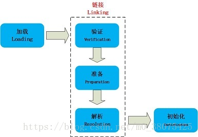
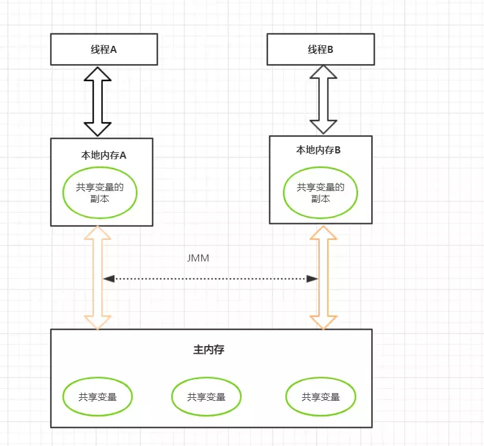
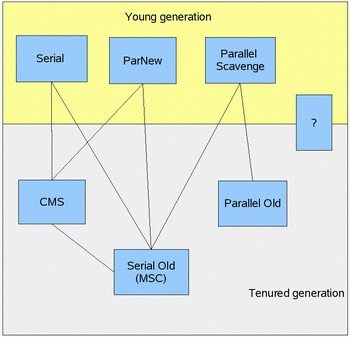
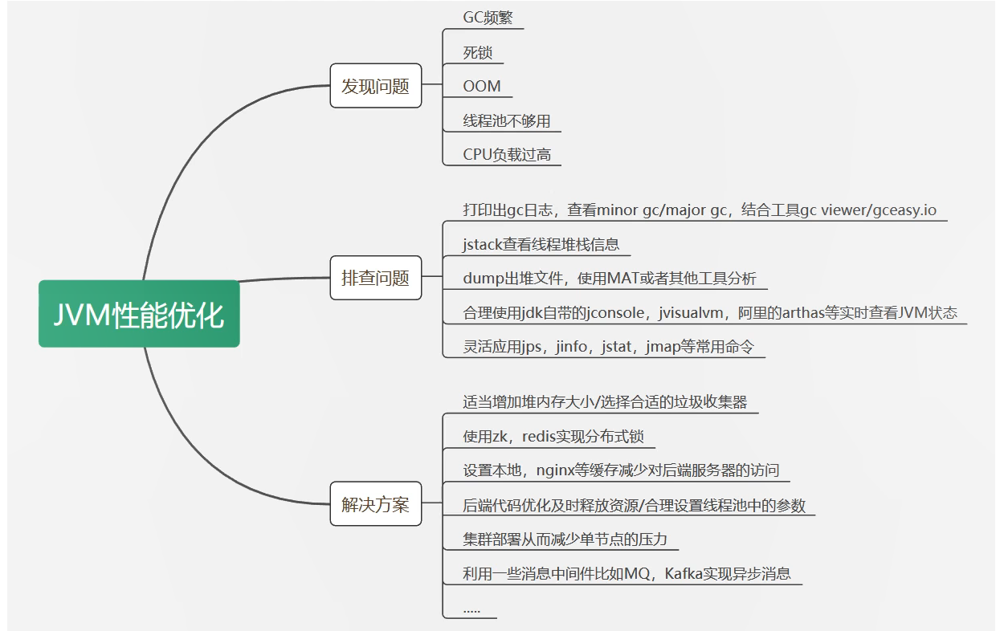
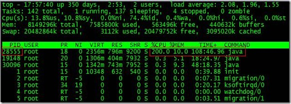
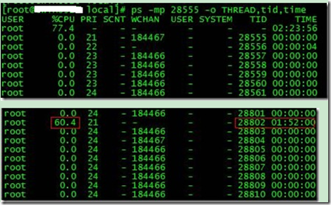
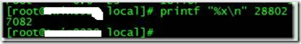

### jvm 类加载机制
加载--->链接--->初始化

    1.**加载**    
    类的加载通过双亲委派原则将对用的类加载到运行时数据区,将类的原数据比如类的字节码文件,方法名等加载到方法区.将类的对象加载到堆内存.
    类加载器是:应用类加载器,拓展类加载器,bootstrapClassLoad
    2.**链接**
      1.验证
        校验方法的合理性
      2.准备
        为静态变量分配内存,设置默认值
      3.解析
        将符号引用改为直接引用
### JVM内存模型
    
    Java内存模型规定了所有的变量都存储在主内存中，每条线程还有自己的工作内存，
    线程的工作内存中保存了该线程中是用到的变量的主内存副本拷贝，线程对变量的所有操作都必须在工作内存中进行，
    而不能直接读写主内存。不同的线程之间也无法直接访问对方工作内存中的变量，
    线程间变量的传递均需要自己的工作内存和主存之间进行数据同步进行
#### 指令重排序
     大多数现代微处理器都会采用将指令乱序执行（out-of-order execution，简称OoOE或OOE）的方法，在条件允许的情况下，直接运行当前有能力立即执行的后续指令，避开获取下一条指令所需数据时造成的等待3。通过乱序执行的技术，处理器可以大大提高执行效率。而这就是指令重排。
#### 内存屏障
     ......
#### 一.堆
      注意(常量池也放在堆中)
      堆是用来存放对象的内存空间，几乎所有的对象都存储在堆中。
      线程共享，整个 Java 虚拟机只有一个堆，所有的线程都访问同一个堆。而程序计数器、Java 虚拟机栈、本地方法栈都是一个线程对应一个。
      在虚拟机启动时创建。
      是垃圾回收的主要场所。
      堆可分为新生代（Eden 区：From Survior，To Survivor）、老年代。
      Java 虚拟机规范规定，堆可以处于物理上不连续的内存空间中，但在逻辑上它应该被视为连续的。
      关于 Survivor s0，s1 区: 复制之后有交换，谁空谁是 to。
      不同的区域存放不同生命周期的对象，这样可以根据不同的区域使用不同的垃圾回收算法，更具有针对性。
      堆的大小既可以固定也可以扩展，但对于主流的虚拟机，堆的大小是可扩展的，因此当线程请求分配内存，但堆已满，且内存已无法再扩展时，就抛出 OutOfMemoryError 异常。
      Java 堆所使用的内存不需要保证是连续的。而由于堆是被所有线程共享的，所以对它的访问需要注意同步问题，方法和对应的属性都需要保证一致性。

##### 新生代与老年代
    老年代比新生代生命周期长。
    新生代与老年代空间默认比例 1:2：JVM 调参数，XX:NewRatio=2，表示新生代占 1，老年代占 2，新生代占整个堆的 1/3。
    HotSpot 中，Eden 空间和另外两个 Survivor 空间缺省所占的比例是：8:1:1。
    几乎所有的 Java 对象都是在 Eden 区被 new 出来的，Eden 放不了的大对象，就直接进入老年代了。

##### 对象分配过程
    new 的对象先放在 Eden 区，大小有限制
    如果创建新对象时，Eden 空间填满了，就会触发 Minor GC，将 Eden 不再被其他对象引用的对象进行销毁，再加载新的对象放到 Eden 区，特别注意的是 Survivor 区满了是不会触发 Minor GC 的，而是 Eden 空间填满了，Minor GC 才顺便清理 Survivor 区
    将 Eden 中剩余的对象移到 Survivor0 区
    再次触发垃圾回收，此时上次 Survivor 下来的，放在 Survivor0 区的，如果没有回收，就会放到 Survivor1 区
    再次经历垃圾回收，又会将幸存者重新放回 Survivor0 区，依次类推
    默认是 15 次的循环，超过 15 次，则会将幸存者区幸存下来的转去老年区 jvm 参数设置次数 : -XX:MaxTenuringThreshold=N 进行设置
    频繁在新生区收集，很少在养老区收集，几乎不在永久区/元空间搜集

##### Full GC /Major GC 触发条件
    显示调用System.gc(),老年代的空间不够,方法区的空间不够等都会触发 Full GC，同时对新生代和老年代回收，FUll GC 的 STW 的时间最长，应该要避免
    在出现 Major GC 之前，会先触发 Minor GC，如果老年代的空间还是不够就会触发 Major GC，STW 的时间长于 Minor GC

##### TLAB
    TLAB 的全称是 Thread Local Allocation Buffer，即线程本地分配缓存区，是属于 Eden 区的，这是一个线程专用的内存分配区域，线程私有,默认开启的（当然也不是绝对的，也要看哪种类型的虚拟机）
    堆是全局共享的, 在同一时间，可能会有多个线程在堆上申请空间，但每次的对象分配需要同步的进行（虚拟机采用 CAS 配上失败重试的方式保证更新操作的原子性）但是效率却有点下降
    所以用 TLAB 来避免多线程冲突，在给对象分配内存时，每个线程使用自己的 TLAB，这样可以使得线程同步，提高了对象分配的效率
    当然并不是所有的对象都可以在 TLAB 中分配内存成功，如果失败了就会使用加锁的机制来保持操作的原子性
    -XX:+UseTLAB 使用 TLAB,-XX:+TLABSize 设置 TLAB 大小

##### 逃逸分析
    标量替换
    标量不可在分解的量，java 的基本数据类型就是标量，标量的对立就是可以被进一步分解的量，而这种量称之为聚合量。而在 JAVA 中对象就是可以被进一步分解的聚合量
    替换过程，通过逃逸分析确定该对象不会被外部访问，并且对象可以被进一步分解时，JVM 不会创建该对象，而会将该对象成员变量分解若干个被这个方法使用的成员变量所代替。这些代替的成员变量在栈帧或寄存器上分配空间。
    对象和数组并非都是在堆上分配内存的
    《深入理解 Java 虚拟机中》关于 Java 堆内存有这样一段描述：随着 JIT 编译期的发展与逃逸分析技术逐渐成熟，栈上分配,标量替换优化技术将会导致一些变化，所有的对象都分配到堆上也渐渐变得不那么"绝对"了。
    这是一种可以有效减少 Java 内存堆分配压力的分析算法，通过逃逸分析，Java Hotspot 编译器能够分析出一个新的对象的引用的使用范围从而决定是否要将这个对象分配到堆上。
    当一个对象在方法中被定义后，它可能被外部方法所引用，如作为调用参数传递到其他地方中，称为方法逃逸。
    再如赋值给类变量或可以在其他线程中访问的实例变量，称为线程逃逸
    使用逃逸分析，编译器可以对代码做如下优化：
    同步省略：如果一个对象被发现只能从一个线程被访问到，那么对于这个对象的操作可以不考虑同步。
    将堆分配转化为栈分配：如果一个对象在子程序中被分配，要使指向该对象的指针永远不会逃逸，对象可能是栈分配的候选，而不是堆分配。
    分离对象或标量替换：有的对象可能不需要作为一个连续的内存结构存在也可以被访问到，那么对象的部分（或全部）可以不存储在内存，而是存储在 CPU 寄存器中。
    public static StringBuffer createStringBuffer(String s1, String s2) {
    
        StringBuffer s = new StringBuffer();
    
        s.append(s1);
    
        s.append(s2);
    
        return s;
    }
    s 是一个方法内部变量，上边的代码中直接将 s 返回，这个 StringBuffer 的对象有可能被其他方法所改变，导致它的作用域就不只是在方法内部，即使它是一个局部变量，但还是逃逸到了方法外部，称为方法逃逸。
    还有可能被外部线程访问到，譬如赋值给类变量或可以在其他线程中访问的实例变量，称为线程逃逸。
    在编译期间，如果 JIT 经过逃逸分析，发现有些对象没有逃逸出方法，那么有可能堆内存分配会被优化成栈内存分配。
    jvm 参数设置，-XX:+DoEscapeAnalysis ：开启逃逸分析 ，-XX:-DoEscapeAnalysis ： 关闭逃逸分析
    从 jdk 1.7 开始已经默认开始逃逸分析。

#### 二.栈
    Java 虚拟机栈是描述 Java 方法运行过程的内存模型。
    Java 虚拟机栈会为每一个即将运行的 Java 方法创建一块叫做“栈帧”的区域，用于存放该方法运行过程中的一些信息，如：
    局部变量表
    操作数栈
    动态链接
    方法出口信息

##### 局部变量表
    定义为一个数字数组，主要用于存储方法参数、定义在方法体内部的局部变量，数据类型包括各类基本数据类型，对象引用，以及 return address 类型。
    局部变量表容量大小是在编译期确定下来的。最基本的存储单元是 slot，32 位占用一个 slot，64 位类型（long 和 double）占用两个 slot。
    
    对于 slot 的理解：
    JVM 虚拟机会为局部变量表中的每个 slot 都分配一个访问索引，通过这个索引即可成功访问到局部变量表中指定的局部变量值。
    如果当前帧是由构造方法或者实例方法创建的，那么该对象引用 this，会存放在 index 为 0 的 slot 处，其余的参数表顺序继续排列。
    栈帧中的局部变量表中的槽位是可以重复的，如果一个局部变量过了其作用域，那么其作用域之后申明的新的局部变量就有可能会复用过期局部变量的槽位，从而达到节省资源的目的。
    在栈帧中，与性能调优关系最密切的部分，就是局部变量表，方法执行时，虚拟机使用局部变量表完成方法的传递局部变量表中的变量也是重要的垃圾回收根节点，只要被局部变量表中直接或间接引用的对象都不会被回收。

##### 操作数栈
    与局部变量表一样，均以字长为单位的数组。不过局部变量表用的是索引，操作数栈是弹栈/压栈来访问。操作数栈可理解为java虚拟机栈中的一个用于计算的临时数据存储区。
    存储的数据与局部变量表一致含int、long、float、double、reference、returnType，操作数栈中byte、short、char压栈前(bipush)会被转为int。
    数据运算的地方，大多数指令都在操作数栈弹栈运算，然后结果压栈。
    java虚拟机栈是方法调用和执行的空间，每个方法会封装成一个栈帧压入占中。其中里面的操作数栈用于进行运算，当前线程只有当前执行的方法才会在操作数栈中调用指令（可见java虚拟机栈的指令主要取于操作数栈）。
    int类型在-1~5、-128~127、-32768~32767、-2147483648~2147483647范围分别对应的指令是iconst、bipush、sipush、ldc(这个就直接存在常量池了)

##### 方法返回地址
    当一个方法开始执行后,只有两种方式可以退出，一种是遇到方法返回的字节码指令；一种是遇见异常，并且这个异常没有在方法体内得到处理。

#### 动态链接
    每个栈帧都包含一个指向运行时常量池中该栈帧所属方法的引用，持有这个引用是为了支持方法调用过程中的动态连接(Dynamic Linking)。在后面的方法调用中会详细介绍。
   
### Java 虚拟机栈的特点
    运行速度特别快,仅仅次于 PC 寄存器。
    局部变量表随着栈帧的创建而创建，它的大小在编译时确定，创建时只需分配事先规定的大小即可。在方法运行过程中，局部变量表的大小不会发生改变。
    Java 虚拟机栈会出现两种异常：StackOverFlowError 和 OutOfMemoryError。
    StackOverFlowError 若 Java 虚拟机栈的大小不允许动态扩展，那么当线程请求栈的深度超过当前 Java 虚拟机栈的最大深度时，抛出 StackOverFlowError 异常。
    OutOfMemoryError 若允许动态扩展，那么当线程请求栈时内存用完了，无法再动态扩展时，抛出 OutOfMemoryError 异常。
    Java 虚拟机栈也是线程私有，随着线程创建而创建，随着线程的结束而销毁。
    出现 StackOverFlowError 时，内存空间可能还有很多。

#### 三.方法区
    类的元数据:类的定义,方法的定义.常量池,静态变量,方法区是共享的,生命周期和虚拟机一样
#### 四程序计数器
    如果线程正在执行的是一个Java方法，这个计数器记录的是正在执行的虚拟机字节码指令的地址；如果正在执行的是本地（Native）方法，这个计数器值则应为空（Undefined）。此内存区域是唯一一个在《Java虚拟机规范》中没有规定任何OutOfMemoryError情况的区域。
    2.1 程序计数器 程序计数器是一块较小的内存空间，可以看作是当前线程所执行的字节码的行号指示器。
    字节码解释器工作时通过改变这个计数器的值来选取下一条需要执行的字节码指令，分支、循环、跳转、异常处理、线程恢复等功能都需要依赖这个计数器来完成。
    另外，为了线程切换后能恢复到正确的执行位置，每条线程都需要有一个独立的程序计数器，各线程之间计数器互不影响，独立存储，我们称这类内存区域为“线程私有”的内存。
    从上面的介绍中我们知道程序计数器主要有两个作用： 字节码解释器通过改变程序计数器来依次读取指令，从而实现代码的流程控制，如：顺序执行、选择、循环、异常处理。
    在多线程的情况下，程序计数器用于记录当前线程执行的位置，从而当线程被切换回来的时候能够知道该线程上次运行到哪儿了。
    注意：程序计数器是唯一一个不会出现 OutOfMemoryError 的内存区域，它的生命周期随着线程的创建而创建，随着线程的结束而死亡。 # 2.2 Java 虚拟机栈

### 四种引用方式
    强引用：创建一个对象并把这个对象赋给一个引用变量 , 普通 new 出来对象的变量引用都是强引用，有引用变量指向时永远不会被垃圾回收，jvm 即使抛出 OOM，可以将引用赋值为 null，那么它所指向的对象就会被垃圾回收
    软引用：如果一个对象具有软引用，内存空间足够，垃圾回收器就不会回收它，如果内存空间不足了，就会回收这些对象的内存。只要垃圾回收器没有回收它，该对象就可以被程序使用
    弱引用：非必需对象，当 JVM 进行垃圾回收时，无论内存是否充足，都会回收被弱引用关联的对象。
    虚引用：虚引用并不会决定对象的生命周期，如果一个对象仅持有虚引用，那么它就和没有任何引用一样，在任何时候都可能被垃圾回收器回收。

#### 差异
    JDK 1.8 同 JDK 1.7 比，最大的差别就是：元数据区取代了永久代。元空间的本质和永久代类似，都是对 JVM 规范中方法区的实现。不过元空间与永久代之间最大的区别在于：元数据空间并不在虚拟机中，而是使用本地内存。

# GC

## 对象为垃圾的算法
### 一.引用计数法 
    无法解决对象的相互引用的
### 二.可达性分析
    gcRoot:根  类加载器,线程,局部变量表,(?)

## 垃圾回收算法
### 一.标记,清除
    缺点: 内存不连续

### 二.复制算法
    缺点: 浪费内存,时间

### 三.标记,整理
    先标记-->回收-->整理

## 垃圾收集器
   
图中问号是G1

### 一.Serial收集器
    1.单线程收集器
    2.采用复制清除算法
    3.适用新生代
    4.stw时间较长
### 二.parNew收集器
    1.多线程收集器
    2.采用复制清除算法
    3.适用新生代

### 三.parall Scavenge(更加关注吞吐量)
    1.多线程收集器
    2.采用复制清除算法
    3.适用新生代

### 三.parall old
    1.多线程收集器
    2.采用标记整理算法
    3.适用老年代

### 二.parOld收集器
    1.多线程收集器
    2.采用标记整理算法
    3.适用老年代

### CMS(标记整理的算法)
    1.并发垃圾回收的回收器.用户线程和垃圾回收线程一起工作
    2.初始标记停止
    3.并发标记的时候不需要停止
    4.重新标记停止
    5.并发清理
    6.适用于老年代
  
### G1(标记整理的算法)
    目标:满足最小的停顿时间,更高的吞吐量
    2.初始标记停止
    3.并发标记的时候不需要停止
    4.最终标记停止
    6.刷选回收停止
    7.整体上是”标记-整理”算法，从局部(两个Region间)看，基于”复制算法
    8.适用于老年代和新生代
#### G1
    把堆内存分成一个个region
### jvm问题处理策略

## 线上问题排查实践
#### 高cpu占用
    1.top 命令查看cpu占用最高的进程获取pid

    2.查询线程列表(ps -mp pid -o THREAD,Tid,time)获取到线程id
    
    其次将需要的线程ID转换为16进制格式：printf "%x\n" tid

   3.打印线程的堆栈信息 jstack pid |grep tid -A 30
#### 高内存占用
    1.通过top命令查看占用内存最高的进程,拿到进程id
    2.jmap -histo:live pid | head -n 100 获取进程中占内存最高的前n个对象
    3.jmap -dump:live,format=b,file=xxx.xxx [pid]，然后利用MAT工具分析是否存在内存泄漏等等。
    4.也可以通过visvm来实时监控堆的内存变化
#### 频繁fullgc如何排查,如何优化
    1.通过jmap -heap pid 查到堆的参数配置
    2.通过jstat -gc pid 查看最近gc的情况
    3.-XX:+HeapDumpBeforeFullGC 设置每次gc dump日志信息
    4.通过mat或者visvm来分析定位暂用较大内存的对象