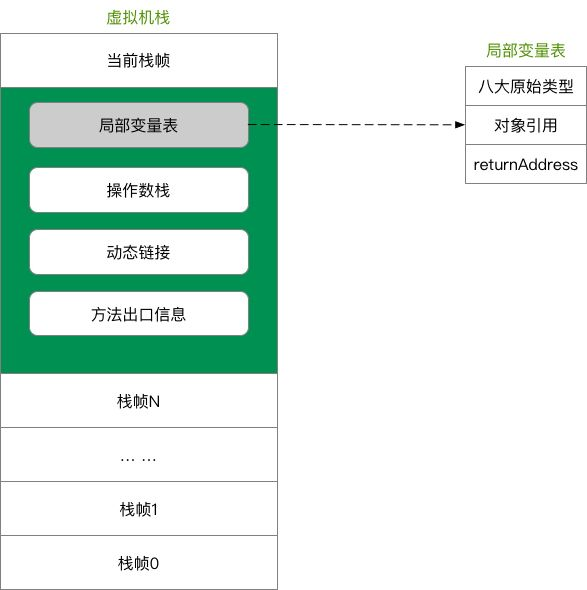

### JVM内存模型

#### 一.堆
      堆是用来存放对象的内存空间，几乎所有的对象都存储在堆中。
      线程共享，整个 Java 虚拟机只有一个堆，所有的线程都访问同一个堆。而程序计数器、Java 虚拟机栈、本地方法栈都是一个线程对应一个。
      在虚拟机启动时创建。
      是垃圾回收的主要场所。
      堆可分为新生代（Eden 区：From Survior，To Survivor）、老年代。
      Java 虚拟机规范规定，堆可以处于物理上不连续的内存空间中，但在逻辑上它应该被视为连续的。
      关于 Survivor s0，s1 区: 复制之后有交换，谁空谁是 to。
      不同的区域存放不同生命周期的对象，这样可以根据不同的区域使用不同的垃圾回收算法，更具有针对性。
      堆的大小既可以固定也可以扩展，但对于主流的虚拟机，堆的大小是可扩展的，因此当线程请求分配内存，但堆已满，且内存已无法再扩展时，就抛出 OutOfMemoryError 异常。
      Java 堆所使用的内存不需要保证是连续的。而由于堆是被所有线程共享的，所以对它的访问需要注意同步问题，方法和对应的属性都需要保证一致性。
##### 新生代与老年代
    老年代比新生代生命周期长。
    新生代与老年代空间默认比例 1:2：JVM 调参数，XX:NewRatio=2，表示新生代占 1，老年代占 2，新生代占整个堆的 1/3。
    HotSpot 中，Eden 空间和另外两个 Survivor 空间缺省所占的比例是：8:1:1。
    几乎所有的 Java 对象都是在 Eden 区被 new 出来的，Eden 放不了的大对象，就直接进入老年代了。
##### 对象分配过程
    new 的对象先放在 Eden 区，大小有限制
    如果创建新对象时，Eden 空间填满了，就会触发 Minor GC，将 Eden 不再被其他对象引用的对象进行销毁，再加载新的对象放到 Eden 区，特别注意的是 Survivor 区满了是不会触发 Minor GC 的，而是 Eden 空间填满了，Minor GC 才顺便清理 Survivor 区
    将 Eden 中剩余的对象移到 Survivor0 区
    再次触发垃圾回收，此时上次 Survivor 下来的，放在 Survivor0 区的，如果没有回收，就会放到 Survivor1 区
    再次经历垃圾回收，又会将幸存者重新放回 Survivor0 区，依次类推
    默认是 15 次的循环，超过 15 次，则会将幸存者区幸存下来的转去老年区 jvm 参数设置次数 : -XX:MaxTenuringThreshold=N 进行设置
    频繁在新生区收集，很少在养老区收集，几乎不在永久区/元空间搜集
##### Full GC /Major GC 触发条件
    显示调用System.gc(),老年代的空间不够,方法区的空间不够等都会触发 Full GC，同时对新生代和老年代回收，FUll GC 的 STW 的时间最长，应该要避免
    在出现 Major GC 之前，会先触发 Minor GC，如果老年代的空间还是不够就会触发 Major GC，STW 的时间长于 Minor GC
##### TLAB
    TLAB 的全称是 Thread Local Allocation Buffer，即线程本地分配缓存区，是属于 Eden 区的，这是一个线程专用的内存分配区域，线程私有,默认开启的（当然也不是绝对的，也要看哪种类型的虚拟机）
    堆是全局共享的, 在同一时间，可能会有多个线程在堆上申请空间，但每次的对象分配需要同步的进行（虚拟机采用 CAS 配上失败重试的方式保证更新操作的原子性）但是效率却有点下降
    所以用 TLAB 来避免多线程冲突，在给对象分配内存时，每个线程使用自己的 TLAB，这样可以使得线程同步，提高了对象分配的效率
    当然并不是所有的对象都可以在 TLAB 中分配内存成功，如果失败了就会使用加锁的机制来保持操作的原子性
    -XX:+UseTLAB 使用 TLAB,-XX:+TLABSize 设置 TLAB 大小
##### 逃逸分析
    标量替换
    标量不可在分解的量，java 的基本数据类型就是标量，标量的对立就是可以被进一步分解的量，而这种量称之为聚合量。而在 JAVA 中对象就是可以被进一步分解的聚合量
    替换过程，通过逃逸分析确定该对象不会被外部访问，并且对象可以被进一步分解时，JVM 不会创建该对象，而会将该对象成员变量分解若干个被这个方法使用的成员变量所代替。这些代替的成员变量在栈帧或寄存器上分配空间。
    对象和数组并非都是在堆上分配内存的
    《深入理解 Java 虚拟机中》关于 Java 堆内存有这样一段描述：随着 JIT 编译期的发展与逃逸分析技术逐渐成熟，栈上分配,标量替换优化技术将会导致一些变化，所有的对象都分配到堆上也渐渐变得不那么"绝对"了。
    这是一种可以有效减少 Java 内存堆分配压力的分析算法，通过逃逸分析，Java Hotspot 编译器能够分析出一个新的对象的引用的使用范围从而决定是否要将这个对象分配到堆上。
    当一个对象在方法中被定义后，它可能被外部方法所引用，如作为调用参数传递到其他地方中，称为方法逃逸。
    再如赋值给类变量或可以在其他线程中访问的实例变量，称为线程逃逸
    使用逃逸分析，编译器可以对代码做如下优化：
    同步省略：如果一个对象被发现只能从一个线程被访问到，那么对于这个对象的操作可以不考虑同步。
    将堆分配转化为栈分配：如果一个对象在子程序中被分配，要使指向该对象的指针永远不会逃逸，对象可能是栈分配的候选，而不是堆分配。
    分离对象或标量替换：有的对象可能不需要作为一个连续的内存结构存在也可以被访问到，那么对象的部分（或全部）可以不存储在内存，而是存储在 CPU 寄存器中。
    public static StringBuffer createStringBuffer(String s1, String s2) {
    
        StringBuffer s = new StringBuffer();
    
        s.append(s1);
    
        s.append(s2);
    
        return s;
    }
    s 是一个方法内部变量，上边的代码中直接将 s 返回，这个 StringBuffer 的对象有可能被其他方法所改变，导致它的作用域就不只是在方法内部，即使它是一个局部变量，但还是逃逸到了方法外部，称为方法逃逸。
    还有可能被外部线程访问到，譬如赋值给类变量或可以在其他线程中访问的实例变量，称为线程逃逸。
    在编译期间，如果 JIT 经过逃逸分析，发现有些对象没有逃逸出方法，那么有可能堆内存分配会被优化成栈内存分配。
    jvm 参数设置，-XX:+DoEscapeAnalysis ：开启逃逸分析 ，-XX:-DoEscapeAnalysis ： 关闭逃逸分析
    从 jdk 1.7 开始已经默认开始逃逸分析。

#### 二.栈
    Java 虚拟机栈是描述 Java 方法运行过程的内存模型。
    Java 虚拟机栈会为每一个即将运行的 Java 方法创建一块叫做“栈帧”的区域，用于存放该方法运行过程中的一些信息，如：
    局部变量表
    操作数栈
    动态链接
    方法出口信息

#### 三.元空间

#### 差异
JDK 1.8 同 JDK 1.7 比，最大的差别就是：元数据区取代了永久代。元空间的本质和永久代类似，都是对 JVM 规范中方法区的实现。不过元空间与永久代之间最大的区别在于：元数据空间并不在虚拟机中，而是使用本地内存。