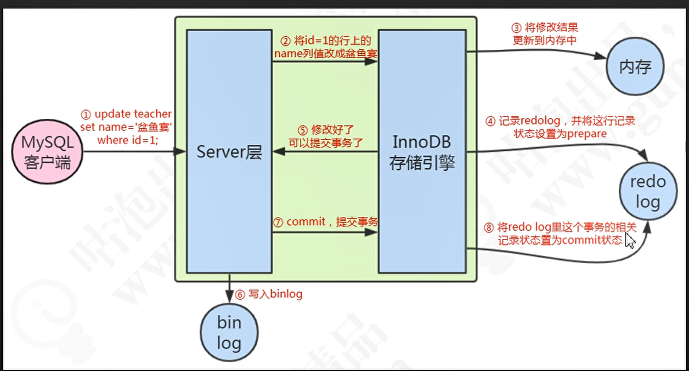
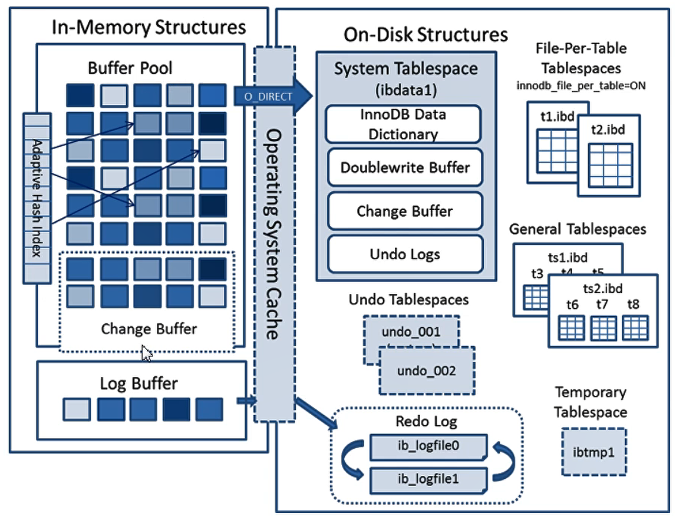
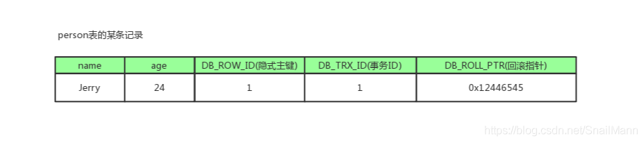

# mysql
### 执行流程
    update 的执行流程:log-buffer--->redolog--->binlog--->db
    logbuffer是内存,默认是一个事务提交后都会同步到redolog
    redolog 是顺序 IO 写入Db是随机IO
    redolog 是覆盖写

### UNDOLOG
    回滚日志
### BINLOG
    用于数据的备份同步
### 索引使用原则
    1. 选择没有顺序的id有可能导致页分裂
    2.btree索引的优势:查询效率高,索引树深度不高
    3.hash索引:没有排序,只能做等值查询,hash碰撞问题
    4.主键索引是聚簇索引,其他都是辅助索引
    5.索引遵循最左原则
### mysql事务与锁
#### 1.mvcc原理
    MVCC的目的就是多版本并发控制，在数据库中的实现，就是为了解决读写冲突，它的实现原理主要是依赖记录中的 3个隐式字段，undo日志 ，Read View 来实现的
    undolog记录不同的版本数据,readreview通过不同的隔离级别来实现数据的数据的可见性
    每行记录除了我们自定义的字段外，还有数据库隐式定义的DB_TRX_ID,DB_ROLL_PTR,DB_ROW_ID等字段
    DB_TRX_ID:
    6byte，最近修改(修改/插入)事务ID：记录创建这条记录/最后一次修改该记录的事务ID
    DB_ROLL_PTR:
    7byte，回滚指针，指向这条记录的上一个版本（存储于rollback segment里）
    DB_ROW_ID:
    6byte，隐含的自增ID（隐藏主键），如果数据表没有主键，InnoDB会自动以DB_ROW_ID产生一个聚簇索引

#### 2.锁的的类型
##### 锁实现
    InnoDB 行锁是通过给索引上的索引项加锁来实现的，这一点 MySQL 与 Oracle 不同，后者是通过在数据块中对相应数据行加锁来实现的。
    InnoDB 这种行锁实现特点意味着：只有通过索引条件检索数据，InnoDB 才使用行级锁，否则，InnoDB 将使用表锁！
    不论是使用主键索引、唯一索引或普通索引，InnoDB 都会使用行锁来对数据加锁。
    只有执行计划真正使用了索引，才能使用行锁：即便在条件中使用了索引字段，但是否使用索引来检索数据是由 MySQL 通过判断不同执行计划的代价来决定的，
    如果 MySQL 认为全表扫描效率更高，比如对一些很小的表，它就不会使用索引，这种情况下 InnoDB 将使用表锁，而不是行锁。因此，在分析锁冲突时，
    别忘了检查 SQL 的执行计划（可以通过 explain 检查 SQL 的执行计划），以确认是否真正使用了索引。（更多阅读：MySQL索引总结）
    由于 MySQL 的行锁是针对索引加的锁，不是针对记录加的锁，所以虽然多个session是访问不同行的记录， 但是如果是使用相同的索引键， 
    是会出现锁冲突的（后使用这些索引的session需要等待先使用索引的session释放锁后，才能获取锁）。 应用设计的时候要注意这一点。
##### 共享锁:其他事务可以读，但不能写。
##### 排他锁:其他事务不能读取，也不能写。字符串的索引通过ascll码来排序
#### 记录锁:行锁
#### 间隙锁
    当我们用范围条件而不是相等条件检索数据，并请求共享或排他锁时，InnoDB会给符合条件的已有数据记录的索引项加锁；对于键值在条件范围内但并不存在的记录，叫做“间隙（GAP)”，InnoDB也会对这个“间隙”加锁，这种锁机制就是所谓的间隙锁（Next-Key锁）。
    很显然，在使用范围条件检索并锁定记录时，InnoDB这种加锁机制会阻塞符合条件范围内键值的并发插入，这往往会造成严重的锁等待。因此，在实际应用开发中，尤其是并发插入比较多的应用，我们要尽量优化业务逻辑，尽量使用相等条件来访问更新数据，避免使用范围条件。
    InnoDB使用间隙锁的目的：
    防止幻读，以满足相关隔离级别的要求；
    满足恢复和复制的需要：
    MySQL 通过 BINLOG 录入执行成功的 INSERT、UPDATE、DELETE 等更新数据的 SQL 语句，并由此实现 MySQL 数据库的恢复和主从复制。MySQL 的恢复机制（复制其实就是在 Slave Mysql 不断做基于 BINLOG 的恢复）有以下特点：
    一是 MySQL 的恢复是 SQL 语句级的，也就是重新执行 BINLOG 中的 SQL 语句。
    二是 MySQL 的 Binlog 是按照事务提交的先后顺序记录的， 恢复也是按这个顺序进行的。
    由此可见，MySQL 的恢复机制要求：在一个事务未提交前，其他并发事务不能插入满足其锁定条件的任何记录，也就是不允许出现幻读。
### 临键锁:next key lock

##### 死锁（Deadlock Free）
    死锁产生：
    死锁是指两个或多个事务在同一资源上相互占用，并请求锁定对方占用的资源，从而导致恶性循环。
    当事务试图以不同的顺序锁定资源时，就可能产生死锁。多个事务同时锁定同一个资源时也可能会产生死锁。
    锁的行为和顺序和存储引擎相关。以同样的顺序执行语句，有些存储引擎会产生死锁有些不会——死锁有双重原因：真正的数据冲突；存储引擎的实现方式。
    检测死锁：数据库系统实现了各种死锁检测和死锁超时的机制。InnoDB存储引擎能检测到死锁的循环依赖并立即返回一个错误。
    死锁恢复：死锁发生以后，只有部分或完全回滚其中一个事务，才能打破死锁，InnoDB目前处理死锁的方法是，将持有最少行级排他锁的事务进行回滚。所以事务型应用程序在设计时必须考虑如何处理死锁，多数情况下只需要重新执行因死锁回滚的事务即可。
    外部锁的死锁检测：发生死锁后，InnoDB 一般都能自动检测到，并使一个事务释放锁并回退，另一个事务获得锁，继续完成事务。但在涉及外部锁，或涉及表锁的情况下，InnoDB 并不能完全自动检测到死锁， 这需要通过设置锁等待超时参数 innodb_lock_wait_timeout 来解决
    死锁影响性能：死锁会影响性能而不是会产生严重错误，因为InnoDB会自动检测死锁状况并回滚其中一个受影响的事务。在高并发系统上，当许多线程等待同一个锁时，死锁检测可能导致速度变慢。 有时当发生死锁时，禁用死锁检测（使用innodb_deadlock_detect配置选项）可能会更有效，这时可以依赖innodb_lock_wait_timeout设置进行事务回滚。
#### 3.事务
    1.原子性,一致性,持久性,隔离性
    事务并发的问题

#### 4.不同隔离级别的影响
    读未提交: 脏读,幻读,不可重复读
    读已提交: 幻读,不可重复读
    可重复读: 没有问题(gap lock)
    串行化: 都解决

#### 隔离级别的问题解释
    脏读:读到了其他事务没有提交的数据
    不可重复读:多次读取的数据都不相同
    幻读:读取的数据对后续操作有影响,比如第一次读不存在,第二次读有存在了.
## 优化
    链接数:cup*2+1
    主从复制延迟(会有延迟的原因是redolog的日志串性化执行不是并发执行的):1.过半提交,gtid
