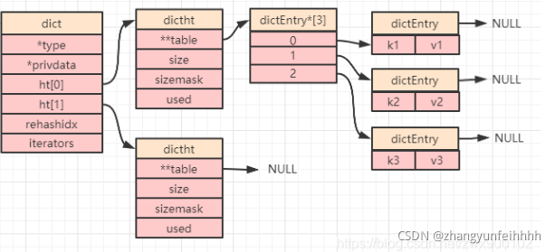

#redis
    基本使用类型(7种)
    string key-value(最大的容量都是521M)
      核心命令:
        set
        get
        incr
        decr
        bitSet
      编码方法:字符串默认是raw,超过44个字节就是emStr,计算之后就是raw ,数字类型是 int
      SDS设计优点
      通过SDS的定义可用看出，和直接使用c的字符相比，SDS具有如下特性，而redis对外支持的String类型也会继承其特点：
      常数复杂度获取字符串长度：因为SDS定义了len字段来记录自身长度，而C字符串的长度需要去遍历整个字符串，复杂度为O(n),这里的设计就提现出来redis在细节之处对性能的追求
      杜绝缓存区溢出：C字符串不记录自身长度，如果在执行字符串拼接操作时，缓存区没有足够的内存，一旦忘记分配新的内存，就会发生缓存区溢出，
      可能对它相邻的数据造成覆盖，而对SDS进行修改时，SDS可以通过保存的长度和空间信息进行空间检验，如果内存不足，会进行扩容操作
      减少内存重分配次数：对于C字符串的修改，无论是增长还是缩短，都需要进行一次内存的重新分配，这样就会导致大量的时间浪费在内存的分配上，
      而SDS通过free来记录未使用空间，解除了字符串长度和底层数组之间的长度关联，通过空间预分配和惰性空间释放的方式来减少内存重新分配的次数，
      优化reids对数据频繁修改场景下的性能
      
      二进制安全：C字符串通过末尾的空字符来确认读取的结束，这就对字符串的存储带来了限制，因为C字符串的中间不能出现空字符，否则会导致空字符后面的数据不能被读取，
      而SDS通过len字段保存了字符串的长度，这样在读取的时候就不需要通过空字符来确认是否读取完全，直接按照len来读取指定长度的字符串，这样使得redis不仅能保存字符串，
      还能保存任意格式的二进制数据

     
      使用场景
        1,缓存
        2,分布式锁
        3,分布式全局ID
        6,限流
        7,位运算
    
    map
        Hget
        Hset
      存储结构:ziplist ,hashtable
      
          set
              sadd key :先set中加入原素
              smembers key :是否存在key
              scard key : value 的数量`
              srandmember key : 随机获取一个key
              spop key :弹出一个元素
              srem key , value1,value2 :删除某个元素
              sismember key value : 是否某个元素
              sdiff  :取2个集合的差集    
              sinter :交集
              sunion :并集
            存储结构
               1.intset 2,hashtab 里面的key
            使用
               点赞,打卡,签到,抽奖
      集合存储数据的底层实现包括整数集合（intset）和字典（hashtable），当set保存的数据都为整数且元素个数不超过512个时，使用整数集合（intset），否则使用字典（hashtable）。
      4.1、整数集合（intset）
      整数集合是redis用于保存整数值的集合抽象数据结构，他可以保证集合中不会出现重复的元素，其定义如下

      typedef struct intset {
      //编码方式
      uint32_t encoding;
      //元素个数
      uint32_t length;
      //保存元素的数组
      int8_t contents[];
      }
      数据结构图：
      如我们看到的定义和结构图，intset保存有数据的编码和数据量，其中数据真正的存储是在contents数组里面，这里和java中的list定义有的类似，
      我们看到定义中有一个用来表示编码方式的encoding字段，这个字段用来标记contents存储的数据类型，但是这个整数集合，顾名思义是用来保存整数的，为什么还需要一个类型的标记字段呢？
      
      encoding：
      这个字段主要用来确认需要为每个元素分配的内存空间大小，encoding的取值有三个：int16_t、int32_t、int64_t,每个类型表示contents数组里可放元素的大小，
      类似于shot、int、long，依次向上可存储的数据大小范围越大，通过这三个类型，intset可以实现更精细化的内存分配，到达节约内存的目的，
      比如insert里面存储的都是int16_t范围内的数据，那他就可以只为每个元素分配16位的内存，
      当都是int16_t数据的insert插入int32_t的数据时，int16_t会扩张内存幷将所有的int16_t转换为int32_t，来完成contents类型升级，进而能存储32位的数字，
      以此内推到int64_t，但是不能反着进行降级，也就是说即使这个32位的数字删除了，也不会再转回int16_t，这样可以防止数据跨度大且修改频繁导致反复升级降级的情况，
      影响性能，可以看出如果直接使用int64_t那肯定可以存储所有的可能数字，但是这样的话，就必须为每个元素分配64位的空间，如果我们都是存储int16_t范围的数据呢，
      这样就会造成空间的浪费，而且在实际业务使用过程中，一般集合存储的数据都是比较相近的，因此前面说到的类型升级一般不会很多。
      集合专门为整数存储设计对应的intset就是出于对内存的考虑，这里通过encoding又对内存做了进一步的优化。
      
      4.2、字典（hashtable）
      字典在介绍hash的时候已经做了介绍，使用的是同一个定义，但是集合存储的是非重复的单个元素，所以使用上和hash有细微的差别，那就是字典的每个健都是一个字符串对象，
      用来存储元素，而字典对应的值则全部设置为null，所以集合在使用字典时，只用到了健存储，结构如下：
      
      4.3、整数集合和字典
      和前面介绍的List、hash一样，集合使用两种存储结构作为底层实现也是出于内存与性能平衡的目的，在存储较少的整数数值时，使用整数集合来实现，因为相比于字符串，
      二进制数值占用的内存更小，而且redis根据存储的元素范围，精准的进行内存划分，进一步减少内存的损耗，在元素较多时，使用字典来实现，
      因为整数集合的全遍历寻值会产生O（n）复杂度的操作，而使用字典是O（1）操作，在元素较多的情况下，使用整数集合会使的查询过程非常耗时，
      因此集合的整体的设计思想也是在元素较少时，性能消耗较小，使用时间换空间，而在元素较多的情况下，优先保证性能，转换为空间换时间的策略，

    list
       存储结构:quicklist
    hyperLoglogs
      用来座=作为基数统计
    geospatial 
      地理位置的经纬度
    streams 
      发布订阅
      压缩列表的特点
      从上面所给出的ziplist结构，我们可以结合来看看ziplist所具有的如下特性
      ziplist压缩表是紧凑存储的，没有多余的空间，进而达到节约内存的目的，而同时也会导致ziplist不适合存储大量的数据数据或者大型数据，因为要保证数据都是紧凑存储的，每次添加元素都会扩展新的内存，如果当前内存块没有足够的空间用来扩展，那就需要重新分配新的内存空间幷进行数据拷贝，而数据拷贝是非常消耗性能的，特别是在redis单线程的特性下，会严重影响后续的操作，因此在列表项比较小且都是小整数值或者较短字符串时才会用ziplist来作为的底层实现
      有专门的字段记录尾节点的偏移量，因此可以以O(1)的复杂度获取到尾结点
      每个节点用previous_entry_length保存了前一个节点的长度，因此可以O(1)的复杂度获取当前节点的前一个节点地址
      每个节点用encoding保存了数据的长度，因此可以O(1)的复杂度获取当前节点的下一个节点
      
      综合3和4点，压缩列表可以同时满足向前或向后遍历
      根据zltail和各个节点的previous_entry_length，可以从后向前遍历到每一个节点
      linkedlist(链表)
      链表提供了高效的节点重排能力，以及顺序性的节点访问方式，并且可以通过增删节点来灵活的调整链表的长度，链表作为一种常用的数据结构，在redis中不仅作为列表和hash的底层实现之一，而且在reids本身的发布与订阅、慢查询、监视器等功能实现中都有使用
      
      链表和链表节点
      //链表节点
      typedef struct listNode {
      //前置节点
      struct listNode *prev;
      //后置节点
      struct listNode *next;
      //节点值
      void *value;
      }listNode
      //链表定义
      typedef struct list {
      //头节点
      listNode *head;
      //尾节点
      listNode *tail;
      //节点数量
      unsigned long len;
      }listNode
      list和listNode结构图：
      
      链表特点
      reids的链表实现和我们平常接触的大部分双端链表实现相似，即节点包含了前置节点和后置节点，链表包含了头结点，尾结点及其他一些基础信息，因此redis的链表也具备了链表的一些特点：
      
      链表节点带有prev和next,因此可以O(1)复杂度获取某个节点的前置节点和后置节点
      
      可以O(1)复杂度获取头结点和尾结点
      
      因为记录了节点数量，因此可以O(1)复杂度获取链表长度
      
      具备从后到前、从前到后的遍历能力
      
      压缩列表和链表
      list（列表）实现的数据结构包括ziplist和linkedlist两个，对比上面两种数据结构的内部实现细节我们可以发现，redis同时使用这两个数据结构，
      是出于平衡内存和cpu的目的，ziplist压缩表是紧凑存储的，每次添加元素都是在数据后扩展新的内存，然后紧密存储，如果当前内存块没有足够的空间用来扩展，
      那就需要重新分配新的内存空间幷对已经存储的数据进行拷贝，可以看做是一种用时间换空间的考量，但是在数据较大或则数据量比较多的情况下，会出现因内存空间不够而导致的大量拷贝操作，这会导致cpu性能损耗过大，这时候就会转到linkedlist存储，以空间换时间。

    zset
        zadd key 20 value:添加到可以
        zrange key 0 ,-1 :所有的元素
        zrevrange key    :倒叙取出元素
        zrangebyscore :按照分数范围取元素
        zrem 删除
        zcard 个数
        zincrby 增加分数
        zcount key 20 60 :分值范围内的value
        zrank key value :获取value 的排名
        zscore key value:获取value 的得分
       存储结构 ziplist,skipList+字典
      五、有序集合(sorted set)
      Redis 有序集合和集合一样元素的集合,且不允许有重复的成员，不同的是每个元素都会关联一个double类型的分数，redis通过分数来为集合中的成员进行从小到大的排序。有序集合的的应用场景和集合类似，只是多了自动排序的能力，主要的场景有：排行榜、权重队列等。其实现的底层数据结构也是两种：ziplist(压缩列表)和跳表（skipList）+字典

      5.1、压缩列表
      在介绍list列表的时候就介绍了压缩列表的数据结构，通过紧密相连的节点来存储元素，来达到节约内存的目的，有序集合和hash对象使用压缩列表实现的数据构造类似，都是相邻两个节点来存储一个元素的信息，只不过hash存储的是键值对，而这里存储的是元素值和排序用的double分数，数据结构图如下：
      
      5.2、跳表
      跳表全称为跳跃列表，是一个允许快速查询，插入和删除的有序数据链表。跳跃列表的平均查找和插入时间复杂度都是O(logn)。快速查询是通过维护一个多层次的链，通过有限次范围查找来实现的，他的效率和红黑树不相上下，但是实现原理相对于红黑树来说简单很多。
      跳跃表节点定义：
      typedef struct zskiplistNode {
      //成员对象
      robj *robj;
      //分值
      double score;
      //后退指针
      struct zskiplistNode *backward;
      //层级信息数组，用来实现跳跃，对应于下图的L1、L2、L3....每个节点所拥有的层级信息是随机的
      struct zskiplistLevel {
      /* 对应level的下一个节点 */
      struct zskiplistNode *forward;
      /* 从当前节点到下一个节点的跨度 */
      unsigned int span;
      } level[];
      } zskiplistNode
      跳表定义：
      typedef struct zskiplist {
      
          //跳跃表的头结点和尾节点，通过这两字段+zskiplistNode的backward和zskiplistLevel的forward可以实现正向和反向遍历
          struct zskiplistNode *header, *tail;
          //当前跳跃表的长度，保留这个字段的主要目的是可以以O(1)复杂度内获取跳跃表的长度
          unsigned long length; 
          /* 跳跃表的节点中level的最大值。但是不包括头结点，头结点包含所有的层级信息---ZSKIPLIST_MAXLEVEL = 32。level的值随着跳跃表中节点的插入和删除随时动态调整 */     
          int level;
      } 
      zskiplist
      redis使用跳表存储集合元素和分值的同时，还使用字典来保持元素和分值的映射关系，利用字典的特性使zscord()的实现只有O(1)复杂度。其定义如下
      
      typedef struct zset {
      //数据字典：用来你存储元素和分数的对应关系
      dict *dict;
      //跳表：用来存储集合元素及元素直接的跳跃关系
      zskiplist *zsl;
      } zset;
      数据结构如下：
      5.3、有序集合实现的特点
      1、在数据较少时使用压缩列表来实现，即使操作数据需要遍历整个列表，但此时数据少，压缩列表不会很长，因此全遍历性能影响不大，但可以达到节约内存的目的
      2、在数据较多的时候，使用跳表来实现，获得和树不相上下查询效率，但是相比于树，实现过程更加简洁
      3、使用跳跃表的同时使用字典来存储元素和分值的映射关系，虽然只通过跳跃表也能获取指定元素分值，但是时间复杂度为o(logn),使用字典时，直接降为了o(1),字典在单值查找性能优良，但是不适合范围查找，而且对于有序集合来说，还需要额外的排序操作，而字典本身存储时没有顺序信息的，所以在跳表上排序以及查询性能更优，如此看来，redis充分考虑到字典和跳表的特性，为达到更优的性能，同时通过两种数据结构保存了数据信息，而且虽然同时用字典和跳表存储了元素和对应的分数，但实际字典和跳表共用了元素和分数对象，所以在内存上，并没有增加太多的支出。

# reids实物
      1.multi 开启事务
      2.exec 执行事务
      3.discard 取消事务
      4.watch 乐观锁机制:
     rdis事务无法保证原子性:
      1.他只能回滚编译是的异常,无法回滚运行时异常
     Lua脚本(实现了多个命令的原子性):如果脚本执行的时间超时;可以设置超时时间;也可以杀死
 # redis 为什么这么快
    1.简单的数据结构
    2.单线程
    3.Io多路复用
# 内存回收
    1.定时淘汰:设置了TTL
    2.惰性淘汰
    3.定期淘汰
    LRU :最近最少使用:全局时钟的时间(194),所有key的时间和全局时钟作比较
    Lfu :访问频率 :通过递增和递减的基数来实现
# redis持久化的机制
    RDB :数据量小,性能好 
    dump.rdb
    AOF : 最多就是1s的数据
    可以同时开启
   写实复制技术,健康状态,
# redis 分布式
### 主从备份
    全量复制:基于RDB文件
    增量复制:基于偏移量,主节点和从节点都会保留一份偏移量
    slave of ip 端口 
### 哨兵模式
    不足:数据丢失
    Ratf算法 :先到先得,少数服从多数
    多主多从:
    分区(codies,cluster):通过key找到对应的槽----虚拟槽(16383)---通过槽找到对应的负责的redis实例
### redis 客户端实现
    工作模式:单节点,哨兵,集群,分片 
    请求模式:client ,pipeline,事务
    redisTemplete基于JEDIS,Lettuce
    jedis如何获取哨兵模式下的可操作的实例:通过本地的缓存实例,来映射槽点负责的实例
### 主从一致问题
    1.延迟双删
    2.监听binglog采用mq异步执行redis缓存同步
### 热点数据发现
    1.监控
### 缓存雪崩
    大量的缓存过期
    解决方式:随机的设置过期时间,预热数据,用不过期
### 缓存穿透(解决方式:布隆过滤器)
    现象:数据不存在被持续的访问
### 缓存击穿
   现象就是一个热点数据的缓存失效导致,mysql数据库的压力激增
   解决方式:通过redis分布式锁锁住对应的操作,生成缓存后再释放锁

      1、string（字符串）
      c有自己的String实现，但是redis还是自己实现了SDS用来作为底层字符串的存储结构，通过数据长度及底层数组空闲长度解除了字符串长度和底层数组之间的关联，
      降低了内存分配及数据获取的复杂度，SDS作为redis最终用来存储数据的最底层实现，这些设计给redis带来了可观的性能提升
      2、list（列表）****
      列表项比较小且都是小整数值或者较短字符串时用ziplist来作为的底层实现，通过ziplist紧凑存储的特点来节约内存，在数据较多时，ziplist内存扩展带来的数据拷贝，
      会带来性能上的影响，这时用双端链表来作为底层实现，用空间来降低数据操作的复杂度
      3、hash（哈希）
      列表项比较小且都是小整数值或者较短字符串时用ziplist来作为的底层实现，优缺点和用来存储list列表一样，数据量大时会使用hash表来进行实现，用空间换区时间
      4、set（集合）
      在存储较少的整数数值时，使用整数集合来实现，相比于字符串，二进制数值占用的内存更小，而且根据存储的元素范围，精准的进行内存划分，可以进一步减少内存的损耗，
      在元素较多时，使用字典来实现，将许多操作由O(n)优化为O(1)
      5、zset(sorted set：有序集合)
      相比于set，多了个排序的特性，在元素较少时使用压缩列表来存储，和list、hash相比，只是在存储值时，是用相邻两个节点来存储值和排序分数，结构特性都一样，所以在数据较多时，
      依然会选择另一种数据结构跳表来作为实现。
      
